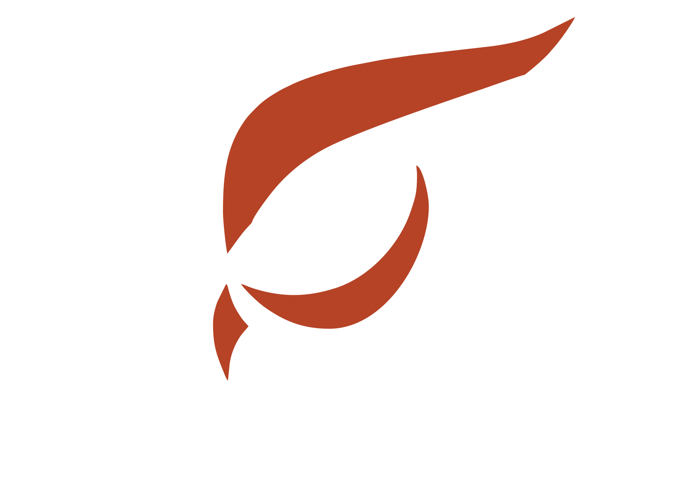
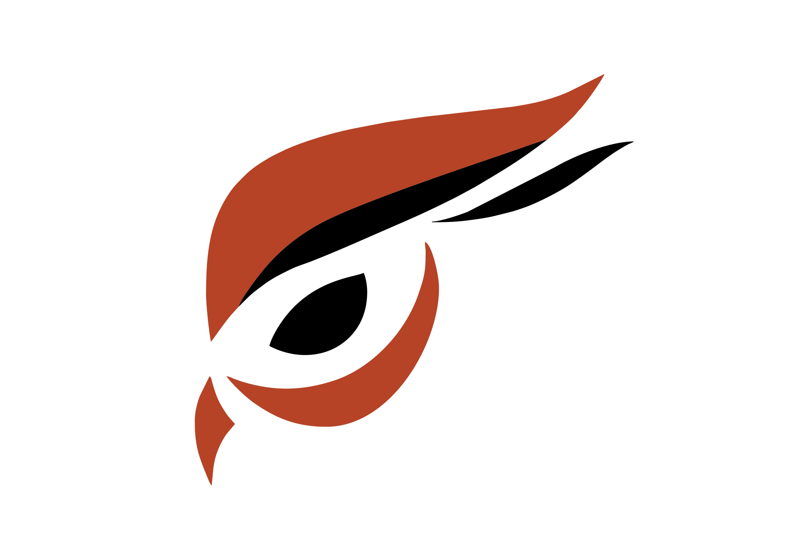

.. _user-index:

=========
User Docs
=========

   

Raptoreum Introduction
======================

Welcome to the Raptoreum (RTM) project, a cryptocurrency initiative designed to advance the security, usability, and decentralization of blockchain technology. This section provides an accessible overview of Raptoreum's core objectives, distinctive features, and its commitment to innovation and community.

Core Objectives
---------------

Raptoreum is driven by several foundational goals:

- **Decentralization**: Ensuring the network remains free from centralized control.
- **Security**: Protecting user assets and data with cutting-edge security measures.
- **Scalability**: Scaling efficiently to accommodate a growing number of transactions.and use cases.
- **User-Friendliness**: Making blockchain technology asily accessible to everyone.
- **Innovation**: Continuously integrating new and innovative technologies.

Raptoreum (RTM) is an innovative cryptocurrency project designed to overcome the scaling and transaction fee issues that challenge established blockchains like Bitcoin and Ethereum. By introducing smart contracts that run on Smartnodes rather than the blockchain itself, Raptoreum significantly enhances efficiency and reduces network congestion. This strategic approach allows for more complex and scalable decentralized applications (dApps) without the burden of high fees or slow processing times, addressing key scalability concerns.

Smartnodes are central to Raptoreum's architecture, supporting not just transaction processing but also providing the infrastructure for advanced features, such as; smart contract storage and execution, transaction decoupling, nd 51% protection. This setup contributes to a more scalable and user-friendly network, avoiding the common bottlenecks experienced by other blockchains.

Raptoreum stands out for its community-driven ethos, with a development model that encourages collaboration and innovation among its users. This approach fosters a rich ecosystem where new ideas and solutions can flourish, further enhancing the project's appeal.

.. _getting-started:

.. toctree::
   :maxdepth: 2

   getting_started/about
   getting_started/features
   getting_started/obtaining
   getting_started/security
   getting_started/info

.. _users:

.. toctree::
   :maxdepth: 2
   :caption: Users
   
   wallets/index
   
.. _network-docs:

.. toctree::
   :maxdepth: 2
   :caption Network
   
   smartnodes/index
   mining/index